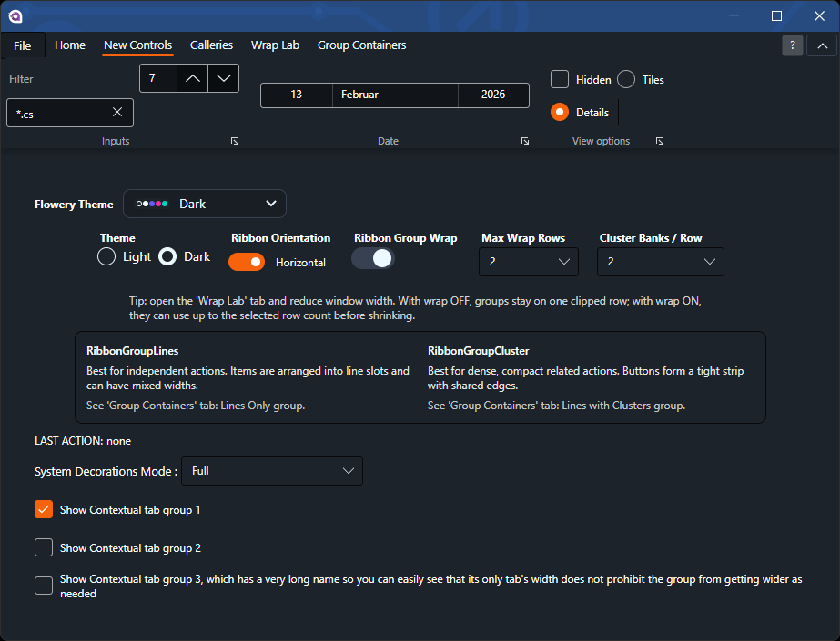
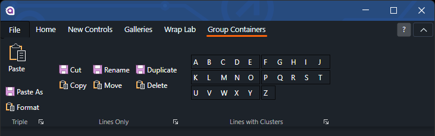
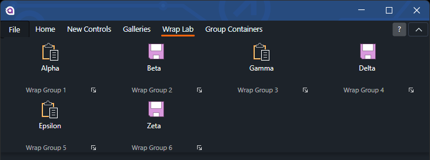

# AvaloniaRibbon

This is a Ribbon Control Component library that replicates Microsoft's Ribbon UI, as seen in Windows 8+'s File Explorer,
Microsoft Office 2007+, and in various other places, for Avalonia. In its present state, it is reasonably usable, but
some features are still missing, so it should not considered complete.

## Project Background

The original project was developed by [amazerol](https://github.com/amazerol/AvaloniaRibbon) and was then optimized
by [Splitwirez](https://github.com/Splitwirez/AvaloniaRibbon). Once the Avalonia 11 was released it was then ported to
11.0.1 by [NOoBODDY](https://github.com/NOoBODDY/AvaloniaRibbon).
The original version of the component is used in **[Jaya File Manager](https://github.com/JayaFM/Jaya)**, but other
projects are welcome to use it as well.

> Note
> This fork by tobitege focuses on providing a current, compilable NuGet version of Avalonia.Ribbon, including fixes, and a Flowery.NET demo to show how to theme the control. To avoid collisions with upstream packages, this fork publishes under its own package IDs: `AvaloniaControls.Ribbon.Flowery` and `AvaloniaControls.Ribbon.Desktop.Flowery`.

## Cross-Platform Support

Given that Avalonia is a cross-platform UI framework and to support the availability, currently, this project is being
optimized by [Sachith Liyanagama](https://github.com/SachiHarshitha/Avalonia.Ribbon).
The overall controls library is refactored as follows.

|          Project          | Usecase             |
|:-------------------------:|---------------------|
|     AvaloniaUI.Ribbon     | Desktop, WASM, etc. |
| AvaloniaUI.Ribbon.Desktop | Desktop Only        |

## Available Controls

In order to support
the [ControlTheme](https://docs.avaloniaui.net/docs/next/basics/user-interface/styling/control-themes) architecture, the
controls are currently being either optimized or re-developed if necessary.
Based on the platform availability the components are summarized as follows.

### Cross-Platform

|   Control Type   | Component Type       |
|:----------------:|----------------------|
|      Ribbon      | Ribbon               |
|      Button      | RibbonButton         |
|  Toggle Button   | RibbonToggleButton   |
|   Split Button   | RibbonSplitButton    |
|     Gallery      | RibbonGallery        |
|   GalleryItem    | GalleryItem          |
| Drop Down Button | RibbonDropDownButton |
|    File Menu     | RibbonMenu           |
|  File Menu Item  | RibbonMenuItem       |
|       Tab        | RibbonTab            |
| Ribbon Group Box | RibbonGroupBox       |
| Ribbon Combo Box | RibbonComboBox       |
| Group Triple     | RibbonGroupTriple    |
| Group Lines      | RibbonGroupLines     |
| Group Cluster    | RibbonGroupCluster   |

## Developer Documentation

- Main controls reference: `docs/main-library-controls.md`
- Group container deep dive: `docs/group-containers.md`

### Desktop Only

Apart from the above-mentioned global components, the desktop-specific controls are presented below.

|   Control Type   | Original           |
|:----------------:|--------------------|
|  Ribbon Window   | RibbonWindow       |
| Quick Access Bar | QuickAccessToolBar |

## Previews

### Flowery demo (latest)

| New controls | Group containers |
| --- | --- |
|  |  |
| Wrapping / overflow | |
|  | |
| Desktop | WASM |
|  |  |
| Ribbon Menu / Backstage | |
|  | |

## How to Use

1. Refer the package according to your usecase as mentioned in above **Cross-Platform Support** Section.

2. Include ribbon styles to App.xaml as shown below.

   Default theme:

    ```xaml
        <StyleInclude Source="avares://AvaloniaUI.Ribbon/Styles/Fluent/AvaloniaRibbon.xaml" />
    ```

   "DESKTOP" theme:

    ```xaml
        <StyleInclude Source="avares://AvaloniaUI.Ribbon.Desktop/Styles/Default/AvaloniaRibbon.xaml" />
    ```

   and localized text (same for both themes):

    ```xaml
        <ResourceInclude Source="avares://AvaloniaUI.Ribbon/Locale/en-ca.xaml" />
    ```

### Use with Flowery.NET (Bridge)

Use this when you want Ribbon visuals to follow Flowery Daisy theme tokens.

1. Add NuGet packages:

   ```xml
   <ItemGroup>
     <PackageReference Include="AvaloniaControls.Ribbon.Flowery" Version="*" />
     <PackageReference Include="Flowery.NET" Version="*" />
     <!-- Optional for desktop-specific controls -->
     <PackageReference Include="AvaloniaControls.Ribbon.Desktop.Flowery" Version="*" />
   </ItemGroup>
   ```

2. Add Flowery theme and Ribbon styles in `App.axaml`:

   ```xaml
   <Application
       xmlns="https://github.com/avaloniaui"
       xmlns:daisy="clr-namespace:Flowery;assembly=Flowery.NET">
     <Application.Resources>
       <ResourceDictionary>
         <ResourceDictionary.MergedDictionaries>
           <ResourceInclude Source="avares://AvaloniaUI.Ribbon/Locale/en-ca.axaml" />
           <ResourceInclude Source="/Themes/FloweryRibbonBridge.axaml" />
         </ResourceDictionary.MergedDictionaries>
       </ResourceDictionary>
     </Application.Resources>
     <Application.Styles>
       <FluentTheme />
       <daisy:DaisyUITheme />
       <StyleInclude Source="avares://AvaloniaUI.Ribbon/Styles/Fluent/AvaloniaRibbon.axaml" />
     </Application.Styles>
   </Application>
   ```

3. Add a bridge resource dictionary (for example `Themes/FloweryRibbonBridge.axaml`) that maps Ribbon legacy brush keys (such as `ThemeBackgroundBrush`, `ThemeAccentBrush*`, `ButtonForeground`, `ToggleButton*`, `ComboBox*`) to Flowery Daisy colors (`DaisyBase*`, `DaisyPrimary*`, `DaisyAccent*`, `DaisyNeutral*`).

For a complete working reference, see:

- `AvaloniaUI.Ribbon.Demo.Flowery/App.axaml`
- `AvaloniaUI.Ribbon.Demo.Flowery/Themes/FloweryRibbonBridge.axaml`

    1. Use the below mentioned sample as an example to use the ribbon control.
       The sample is available in the `AvaloniaUI.Ribbon.Demo` project.

       ```xaml
               <Ribbon Name="RibbonControl" DockPanel.Dock="Top" Orientation="Horizontal" HelpButtonCommand="{Binding HelpCommand}">
                   <RibbonMenu
                   Width="50"
                   KeyTip.KeyTipKeys="F">
                      <RibbonMenuItem Header="New" Group="File" IsTopDocked="True">
                          <RibbonMenuItem.Icon>
                              <Rectangle
                                  Width="32"
                                  Height="32"
                                  Fill="Red" />
                          </RibbonMenuItem.Icon>
                          <RibbonMenuItem.Content></RibbonMenuItem.Content>
                      </RibbonMenuItem>
                      <RibbonMenuItem Header="Open" Group="File" IsTopDocked="True">
                          <RibbonMenuItem.Icon>
                              <Rectangle
                                  Width="32"
                                  Height="32"
                                  Fill="Green" />
                          </RibbonMenuItem.Icon>
                          <RibbonMenuItem.Content>
                              <DockPanel>
                                  <TabControl DockPanel.Dock="Top">
                                      <TabItem Header="TEST" />
                                  </TabControl>
                              </DockPanel>
                          </RibbonMenuItem.Content>
                      </RibbonMenuItem>
                   </Ribbon.Menu>
                   <RibbonTab Header="Button Controls" KeyTip.KeyTipKeys="B">
                       <RibbonTab.Groups>
                           <RibbonGroupBox Header="RibbonButtons" Command="{Binding OnClickCommand}" KeyTip.KeyTipKeys="B">
                               <RibbonButton Content="Large" MinSize="Large" MaxSize="Large">
                                   <RibbonButton.LargeIcon>
                                       <Rectangle Fill="{DynamicResource ThemeForegroundBrush}" Width="32" Height="32">
                                           <Rectangle.OpacityMask>
                                               <ImageBrush Source="/Assets/RibbonIcons/settings.png"/>
                                           </Rectangle.OpacityMask>
                                       </Rectangle>
                                   </RibbonButton.LargeIcon>
                               </RibbonButton>
                           </RibbonGroupBox>
                           <RibbonGroupBox Header="RibbonToggleButtons" Command="{Binding OnClickCommand}" KeyTip.KeyTipKeys="T">
                              <RibbonToggleButton
                                 Content="Large"
                                 Icon="{DynamicResource Icon1}"
                                 LargeIcon="{DynamicResource Icon1Large}"
                                 MaxSize="Large"
                                 MinSize="Large"
                                 QuickAccessIcon="{DynamicResource Icon1QuickAccess}" />
                              <RibbonToggleButton
                                 Content="Medium"
                                 Icon="{DynamicResource Icon2}"
                                 LargeIcon="{DynamicResource Icon2Large}"
                                 MaxSize="Medium"
                                 MinSize="Medium"
                                 QuickAccessIcon="{DynamicResource Icon2QuickAccess}" />
                           </RibbonGroupBox>
                           <RibbonGroupBox Header="RibbonSplitButtons" Command="{Binding OnClickCommand}" KeyTip.KeyTipKeys="S">
                              <SplitButtonControl
                                  x:Name="RibbonSplitButton1"
                                  Content="Large"
                                  Icon="{DynamicResource Icon1}"
                                  LargeIcon="{DynamicResource Icon1Large}"
                                  QuickAccessIcon="{DynamicResource Icon1QuickAccess}"
                                  Size="Large"
                                  Theme="{StaticResource LargeSplitButton}">
                                  <SplitButtonControl.Flyout>
                                      <MenuFlyout Placement="Bottom">
                                          <MenuItem Header="Item 1">
                                              <MenuItem Header="Subitem 1" />
                                              <MenuItem Header="Subitem 2" />
                                              <MenuItem Header="Subitem 3" />
                                          </MenuItem>
                                          <MenuItem Header="Item 2" InputGesture="Ctrl+A" />
                                          <MenuItem Header="Item 3" />
                                      </MenuFlyout>
                                  </SplitButtonControl.Flyout>
                              </SplitButtonControl>
                           </RibbonGroupBox>
                       </RibbonTab.Groups>
                   </RibbonTab>
                   <RibbonTab Header="Galleries" KeyTip.KeyTipKeys="G">
                       <RibbonTab.Groups>
                           <RibbonGroupBox Header="Large gallery" Command="{Binding OnClickCommand}" KeyTip.KeyTipKeys="L">
                                <Gallery Theme="{StaticResource LargeGallery}">
                                  <GalleryItem Content="Item 1">
                                      <GalleryItem.LargeIcon>
                                          <ControlTemplate>
                                              <Rectangle
                                                  Width="32"
                                                  Height="32"
                                                  Fill="Red" />
                                          </ControlTemplate>
                                      </GalleryItem.LargeIcon>
                                  </GalleryItem>
                                  <GalleryItem Content="Item 2">
                                      <GalleryItem.LargeIcon>
                                          <ControlTemplate>
                                              <Rectangle
                                                  Width="32"
                                                  Height="32"
                                                  Fill="OrangeRed" />
                                          </ControlTemplate>
                                      </GalleryItem.LargeIcon>
                                  </GalleryItem>
                                </Gallery>
                           </RibbonGroupBox>
                       </RibbonTab.Groups>
                   </RibbonTab>
               </Ribbon>
       ```

### Ribbon Group Overflow Behavior

By default, ribbon groups keep the existing behavior: a single row that shrinks groups from `Large` to `Small` when width is limited.

For narrow layouts, you can opt in to wrapping groups across rows before shrinking:

```xaml
<Ribbon
    Orientation="Horizontal"
    GroupOverflowBehavior="WrapThenShrink"
    MaxGroupRows="2">
    <!-- Tabs and groups -->
</Ribbon>
```

- `GroupOverflowBehavior="ShrinkOnly"` (default): single-row, shrink-first behavior.
- `GroupOverflowBehavior="WrapThenShrink"`: use up to `MaxGroupRows` rows, then shrink if still overflowing.
- `MaxGroupRows`: minimum value is `1`.
- `MaxGroupRows` has no built-in upper limit in the control; demos can clamp the value for UX (for example `1..10`).
- In horizontal `WrapThenShrink`, default `RibbonGroupWrapPanel` internals cap small-item lines with `MaxGroupRows`.

### Group Containers (Triple / Lines / Cluster)

Use group containers inside `RibbonGroupBox` to create canonical Ribbon layouts:

Developer details (API defaults, layout behavior, styling hooks):

- `docs/group-containers.md`

```xaml
<RibbonGroupBox Header="Clipboard">
    <RibbonGroupTriple>
        <RibbonButton Content="Paste" MinSize="Medium" MaxSize="Large" />
        <RibbonButton Content="Paste Special" MinSize="Small" MaxSize="Medium" />
        <RibbonButton Content="Format" MinSize="Small" MaxSize="Medium" />
    </RibbonGroupTriple>

    <RibbonGroupLines>
        <RibbonButton Content="Cut" MinSize="Small" MaxSize="Medium" />
        <RibbonButton Content="Copy" MinSize="Small" MaxSize="Medium" />
        <RibbonButton Content="Copy Path" MinSize="Small" MaxSize="Medium" />
        <RibbonGroupCluster>
            <RibbonToggleButton Content="Bold" MinSize="Small" MaxSize="Medium" />
            <RibbonToggleButton Content="Italic" MinSize="Small" MaxSize="Medium" />
            <RibbonToggleButton Content="Underline" MinSize="Small" MaxSize="Medium" />
        </RibbonGroupCluster>
    </RibbonGroupLines>
</RibbonGroupBox>
```

All group containers share these base properties:

- `DisplayMode`: inherited from the parent `RibbonGroupBox` (`Large`/`Small` group mode).
- `MinimumSize` / `MaximumSize`: `RibbonControlSize` values (`Small`, `Medium`, `Large`) used to clamp the computed child size range.
- `ItemSpacing`: spacing between arranged child items.

Quick reference:

| Container | `MinimumSize` default | `MaximumSize` default | Large-mode target size |
| --- | --- | --- | --- |
| Base `RibbonGroupContainer` | `Small` | `Large` | `Large` (then clamped by min/max) |
| `RibbonGroupTriple` | `Small` | `Large` | `Large` (then clamped by min/max) |
| `RibbonGroupLines` | `Small` | `Large` | `Medium` (then clamped by min/max) |
| `RibbonGroupCluster` | `Small` | `Medium` | `Medium` (then clamped by min/max) |

`RibbonGroupTriple`:

- Purpose: classic Office-style "three stacked actions" layout.
- Layout model: column-major; fills up to `MaxItemsPerColumn` slots before starting the next column.
- Key properties: `MaxItemsPerColumn` (default `3`) controls vertical stack height, and `ItemAlignment` (`Near`, `Center`, `Far`) controls horizontal alignment inside each slot.
- Sizing: supports `Large`, `Medium`, and `Small` item states via inherited min/max size clamping.

`RibbonGroupLines`:

- Purpose: line-based command lanes (for example 2-line or 3-line command bands).
- Layout model: column-major with configurable line count by display mode.
- Key properties: `LargeLineCount` (default `2`) for large group mode and `SmallLineCount` (default `3`) for small group mode.
- Sizing: coerces child `Large` requests to `Medium`, which matches canonical ribbon line groups.

`RibbonGroupCluster`:

- Purpose: compact "bank" of adjacent small/medium commands that should read as a single unit.
- Layout model: one horizontal row, no internal wrapping.
- Sizing: coerces `Large` to `Medium`; defaults to `ItemSpacing=0` for contiguous buttons.
- Styling: cluster children receive positional classes (`cluster-first`, `cluster-middle`, `cluster-last`, `cluster-single`) and Fluent theme styles apply faint borders globally so banks remain visually distinct in dark and light themes.

Composing banks in rows:

```xaml
<RibbonGroupLines LargeLineCount="2" SmallLineCount="3">
    <RibbonGroupCluster>
        <RibbonButton Content="A" MinSize="Small" MaxSize="Medium" />
        <RibbonButton Content="B" MinSize="Small" MaxSize="Medium" />
        <RibbonButton Content="C" MinSize="Small" MaxSize="Medium" />
    </RibbonGroupCluster>
    <RibbonGroupCluster>
        <RibbonButton Content="D" MinSize="Small" MaxSize="Medium" />
        <RibbonButton Content="E" MinSize="Small" MaxSize="Medium" />
        <RibbonButton Content="F" MinSize="Small" MaxSize="Medium" />
    </RibbonGroupCluster>
</RibbonGroupLines>
```

Each `RibbonGroupCluster` is one bank; `RibbonGroupLines` controls how many banks appear per row via its line-count properties.

## Change Log

### Update (2026-08-22)

- Bump package and application versions to `2026.8.22`.
- Fix the Ribbon group area when an application starts in full-screen mode.
- The group area now uses the current width and stays aligned with the window edges.

### Update (2026-08-13)

- Bump package and application versions to `2026.8.13`.
- Add `RibbonMenu.DisplayMode` with `FullClient` and `Compact` options.
- `FullClient` keeps the File menu across the application client area.
- `Compact` shows the File menu as a content-sized popup over the application.
- The Escape key closes the File menu in both display modes.
- Add a File Menu Mode selector to the Flowery desktop demo.

### Update (2026-08-10)

- Bump package and application versions to `2026.8.10`.
- Add the `Popup` group overflow mode for narrow Ribbon layouts.
- `GroupOverflowBehavior="WrapThenShrink"` enables this mode for groups with `AllowCollapsedPopup="True"`.
- The panel first changes visible groups from `Large` to `Medium`. It does not select `Small` while popup overflow is available.
- When the last visible group no longer fits, the panel moves that group into one shared popup on the right.
- The popup keeps the original group order. Groups return to the Ribbon when more width becomes available.
- The shared button reserves its width on each group row and uses the full Ribbon height.
- A click outside the popup closes it and continues to the application control below the pointer.
- Hover, pressed, and open button states use Ribbon theme resources.
- The layout uses finite host bounds and the current arrange width during resizing. This prevents flicker and unstable one-pixel layout changes.

### Update (2026-08-05)

- Bump package and app versions to `2026.8.5.2`.
- Replace library-template `ChangePropertyAction` usage with static orientation selectors, avoiding assembly-wide type scans during `RibbonWindow` startup and removing the unused behavior dependencies from the library packages.
- Include the core `Ribbon` control template in the desktop style collection so `Ribbon` and `DesktopRibbon` render correctly in the same application.
- Fix `RibbonButton` and `RibbonToggleButton` Quick Access templates so their `QuickAccessIcon` values render, and provide readable recommendation captions instead of control type names.
- Make Quick Access foregrounds, separators, and hover/pressed states readable both inside a `RibbonWindow` title bar and in ordinary ribbon hosts.
- Expose the `QuickAccessToolbarHeight` resource so applications can adapt the default height to their UI density.
- Add the core `RibbonItem.Id` attached property for GUID-safe lookup and App/View QAT persistence; `QuickAccessToolbar.PersistenceId` remains an alias of the same property.
- Keep the File menu anchored to the window's current position and allow dynamically added bottom-docked entries to open normally.
- Make File menu spacing, back-button colors, recent-document visibility, and text sizing consistent with the active theme.
- Make Quick Access button dimensions overridable, use flat button styling, hide the final separator, and wire the Flowery Exit command.

### Update (2026-08-04)

- Bump package and app versions to `2026.8.4`.
- Expand Quick Access Toolbar configuration with independently controllable command items and menu button, a configurable `MoreCommandsCommand`, and persistent pinned commands through `IQuickAccessToolbarPersistenceProvider`, `PersistenceKey`, and stable item `PersistenceId` values.
- Make the ribbon File menu optional and customizable through `Content`, `SmallImage`, `LargeImage`, and `AccentBrush`. Its drop-down arrow can be hidden with `ShowDropDownArrow`, while `DropDownArrowMargin` controls its spacing.
- Improve `RibbonWindow` title-bar integration: the window icon can be toggled independently, custom minimize/maximize/close buttons are available when system decorations are disabled, and custom-chrome windows remain resizable without overlapping native title-bar controls.

### Update (2026-07-29.2)

- Fix auto-height `RibbonButton` controls with `Size="Large"` so icons stay top-aligned across one- and multi-line labels and the complete button surface responds to hover and click.

### Update (2026-07-29)

- Fix collapsed-ribbon popup placement: clicking a tab while the ribbon is collapsed (`IsCollapsed="True"`) now shows the ribbon bar popup directly below the tab row. The popup previously used `Placement="LeftEdgeAlignedBottom"`, which mispositions popups under Avalonia 12 (rendered offset by its own size, effectively invisible); it now uses `Placement="Bottom"` in both the core and desktop horizontal templates.
- Bump Avalonia packages from 12.0.3 to 12.1.0 across libraries, demos, and tests.
- Update GitHub workflow actions to current majors (`checkout` v7, `setup-dotnet` v6, `upload-artifact` v7, `download-artifact` v8, `action-gh-release` v3).

### Update (2026-06-07)

- Add UI Automation peers for `RibbonButton`, `RibbonToggleButton`, `RibbonDropDownButton`, and `RibbonSplitButton` so UIA clients receive stable names, automation IDs, help text, invoke/toggle providers, and expand/collapse state.
- Add regression coverage for ribbon UIA metadata fallbacks, explicit `AutomationProperties`, and automation provider behavior.

### Update (2026-05-11)

- Update the library, desktop package, demos, and tests for Avalonia 12:
  - `Avalonia` packages now target `12.0.3`.
  - `AvaloniaUI.Ribbon` and `AvaloniaUI.Ribbon.Desktop` now target `net8.0`.
  - Browser demo targets now use `net10.0-browser`.
- Update related dependencies, including `Xaml.Behaviors`, `CommunityToolkit.Mvvm`, `System.Text.Json`, `Flowery.NET`, and `Material.Avalonia`.
- Migrate Avalonia 12 API changes:
  - use `WindowDecorations` in place of removed decoration APIs,
  - replace obsolete visual-root access with `TopLevel.GetTopLevel`,
  - remove obsolete binding-validator startup customization.
- Rework desktop `RibbonWindow` chrome/template usage for Avalonia 12 compatibility.

### Update (2026-02-13)

- Add first-class Quick Access Toolbar parity improvements:
  - `Ribbon.QuickAccessItems` now defaults to a reference-unique collection so the same control instance cannot be added twice.
  - Desktop ribbon context menu now toggles QAT add/remove (it no longer disables the action when the item is already pinned).
  - Add/expand desktop QAT sync tests in `DesktopRibbonQuickAccessTests`.
- Complete 3-stage group reduction behavior:
  - `GroupDisplayMode` now includes `Medium`.
  - Group sizing transitions now flow `Large -> Medium -> Small` and re-expand through `Medium`.
  - `RibbonGroupsStackPanel` tests now verify wrap-first (`WrapThenShrink`) behavior before shrinking.
- Normalize style/resource includes to explicit `avares://` URIs in updated ribbon style files and demos for consistent resource resolution.
- Update docs to reflect current QAT API/behavior and parity status (`docs/main-library-controls.md`, `artifacts-local/avalonia-ribbon-krypton-parity-roadmap.md`).
- Complete collapsed-group and launcher parity:
  - `RibbonGroupBox` now exposes `AllowCollapsedPopup`, read-only `IsCollapsedToPopup`, and dedicated `DialogLauncherCommand` / `DialogLauncherCommandParameter` API (with legacy command aliases preserved).
  - `RibbonGroupsStackPanel` can collapse overflowed groups into popup affordances when groups can no longer fit at small size.
- Add missing high-value ribbon-native controls and Fluent styles:
  - `RibbonTextBox`, `RibbonDatePicker`, `RibbonNumericUpDown`, `RibbonCheckBox`, `RibbonRadioButton`, `RibbonLabel`, `RibbonSeparator`.
  - Demo coverage added in both default and Windows 11 demos.
- Add keyboard/shortcut parity upgrades:
  - `ShortcutKeys` support added to actionable controls (`RibbonButton`, `RibbonToggleButton`, `RibbonDropDownButton`, `RibbonSplitButton`, `SplitButtonControl`).
  - Escape now steps back from active tab keytip level to ribbon keytip root before full close.
- Add app-menu recent documents support:
  - New `RibbonRecentDocument` model and `RibbonMenu.RecentDocuments` collection.
  - Recent-doc entries render in dedicated menu section and support command + invocation event flow.
- Add gallery parity upgrades:
  - New gallery ranges model (`GalleryRange`) and hover tracking event (`ItemHoverChanged`).
  - New `Gallery.BringIntoView(int index)` API for index-based navigation.
- Add contextual tab color metadata parity:
  - `RibbonContextualTabGroup.ContextColor` added and synchronized with `Background` for compatibility.
- Add tests for new parity phases (`GroupPopupTests`, `DialogLauncherTests`, `NewControlsTests`, `KeyboardShortcutTests`, `RecentDocsTests`, `GalleryTests`, `ContextualTabGroupTests`).

### Update (2026-02-11)

- Keep `RibbonGroupWrapPanel` as the default internal layout panel in `RibbonGroupBox`.
- Add line-cap support to `RibbonGroupWrapPanel` via `LargeLineCount` / `SmallLineCount`, including cap-aware measure/arrange behavior.
- Bind default horizontal `RibbonGroupWrapPanel.SmallLineCount` to ribbon `MaxGroupRows` when `GroupOverflowBehavior="WrapThenShrink"` to prevent internal over-row rendering.
- Expand regression coverage for group layout behavior in `AvaloniaUI.Ribbon.Tests` (`RibbonGroupContainerTests` and `RibbonGroupsStackPanelTests`).
- Update control/docs references in `README.md` and `docs/main-library-controls.md` to match current `RibbonGroupWrapPanel` behavior.

### Update (2026-02-10)

- Add ribbon group container controls (`RibbonGroupContainer`, `RibbonGroupLines`, `RibbonGroupCluster`, `RibbonGroupTriple`) with alignment/contracts and Fluent style integration.
- Update the default and Flowery demos to showcase the new group container layouts.
- Add a new Windows 11 demo project (`AvaloniaUI.Ribbon.W11`) and centralize Windows 11 ribbon icon resources.
- Add `RibbonGroupContainerTests` to tests project
- Add new documentation pages for group containers and main library controls (docs).
- Refactor nullable contracts for ribbon interfaces and quick-access contracts to match Avalonia API nullability.
- Align converter signatures and null handling (`IValueConverter` / `IMultiValueConverter`) to remove interface nullability mismatches.
- Normalize ribbon control property declarations (`StyledProperty<T>`/`StyledProperty<T?>`) and remove unsafe null unboxing paths.
- Harden template-part and key-tip traversal logic in ribbon/desktop controls to eliminate possible null dereferences.

### Update (2026-02-09)

- Add ribbon group overflow API with `GroupOverflowBehavior` (`ShrinkOnly`, `WrapThenShrink`) and configurable `MaxGroupRows`.
- Implement wrap-then-shrink behavior in `RibbonGroupsStackPanel`, including expansion back to `Large` when space increases.
- Update core and desktop ribbon templates to bind overflow settings and support multi-row group layout.
- Add layout tests in `AvaloniaUI.Ribbon.Tests` for default behavior, wrap-before-shrink behavior, shrink fallback, re-expansion, and `MaxGroupRows > 2`.
- Improve both demo apps (default and Flowery) with:
  - a wrap toggle,
  - configurable max wrap rows (`1..10` in demo UX),
  - responsive options panel wrapping,
  - and a dedicated `Wrap Lab` tab to demonstrate behavior under constrained width.
- Remove deprecated top-right help-pane `ComboBox` from the default desktop demo.
- Fix `RibbonDropDownButton` flyout behavior so it no longer auto-closes shortly after opening and opens reliably again.
- Add script split for launching demos:
  - `scripts/run-desktop.ps1` now runs the regular desktop demo,
  - `scripts/run-flowery.ps` runs the Flowery demo.
- Document ribbon overflow behavior and usage in README.

### Update (08/02/2026)

- Fix visibility/layout issue where `Large` buttons were not correctly hidden when the ribbon bar was collapsed/minimized.
- Add `AvaloniaUI.Ribbon.Demo.Flowery` as a Flowery.NET-based demo project.
- Centralize package version numbering via `Directory.Build.targets`.
- Added Github workflows for CI build and NuGet package release for `AvaloniaControls.Ribbon.Flowery` and `AvaloniaControls.Ribbon.Desktop.Flowery`.

### Update (26/01/2025)

- Add Ribbon ComboBox.
- Rename the Windows project to Desktop.
- Solved the KeyTip visibility issue, due to changes in Avalonia 11.x.
- Remove Default theme.
- Relocate Ribbon Expander toggle to end of the control.
- Solve the GroupBox Separator Visibility.
- Remove the ribbon mouse wheel based scrolling.

### Update (21/01/2025)

- Convert RibbonMenu into modern backstage control with different grouping.
- New Gallary Item with three sizes.
- New Cross-Platform Demo projects.
- Handle ribbon control size change when resize.

### Update (21/11/2023)

- Relocate WindowIcontoImageConverter.
- Solve the issue with the icon to image converter.
- Optimize Quick access bar design with separators.
- Optimize Ribbon Window title Height.
- Update Windows Sample project with quick access toolbar and DecorationsMode Selector.
- Create 3 types of gallery themes.(Large, Medium. Small)

### Update (05/11/2023)

- Create Interfaces
- Refactor Code Base
- Rename xaml to axaml.
- Add Cleanup folder script.
- Update to Avalonia 11.0.5
- Create Browser Sample Project
- Optimize references and Desktop Sample Project.

### Update (01/03/2021)

- Update to Avalonia 0.10
- Added Fluent Theme
- Added contextual tabs
- Added Quick Access Toolbar (Experimental)
- Assorted bugfixes
- Probably something else I forgot to mention lol

### Update (06/03/2020)

- Re-organized some stuff
- `RibbonWindow` is now an actual Window in its own right
- Control size variants are now properties of a control, rather than entirely separate controls
- Added dynamic control size adjustment
- Added `Gallery` control
- Major XAML cleanup
- Switched to using standard Avalonia colours/brushes
- Added `RibbonMenu`
- `Ribbon` can now be collapsed or expanded (shows selected groups temporarily in a `Popup` when a tab is clicked if the
  `Ribbon` is collapsed)
- `Ribbon` can now be horizontally or vertically oriented (real-time value changes are not yet fully functional, but
  compile-time/startup-time changes should work without a hitch)
- `KeyTip`s and Keyboard navigation via ALT are now mostly functional
- Probably something else I forgot to mention lol

### Update (14/11/2019)

- Added separate sample project to demonstrate the usage.
- Architectural improvements have been done.
- Standardized control to be an assembly instead of executable.
- Added ribbon classes to Avalonia's namespace.

### Update (23/06/2019)

- In `App.xaml`, only one line of `<StyleInclude>` is required now.
- Adddition of the special buttons (top part: button, lower part: combobox)
- The entire control is themable now.
- Small button added and its HorizontalGroup.
- Tootips added.

### Update (17/06/2019)

- Control is now fully usable.
- NuGet done.
- Wiki has been written.

Below mentioned are some plans for the future.

- Implement more controls, especially toggle button.
- Allow color stylesheets for a fully customizable control.
- Take care of the resizing matters.

### Update (16/06/2019)

- Improvement of the look &amp; feel of the ribbon.
- Update of the previous preview image with new look &amp; feel.

The remaining things which have be done are as follows.

- Take care of the disapearance of icons in case of window resizing.
- Handle click actions easily.

## Original acknowledgements

Please acknowledge Splitwirez for all the last new features added to the ribbon. As far as I'm concerned, I'm just
centralizing code and updating the nuget.

You can also acknowledge Rubal Walia as well for cleaning up all my messy code.
